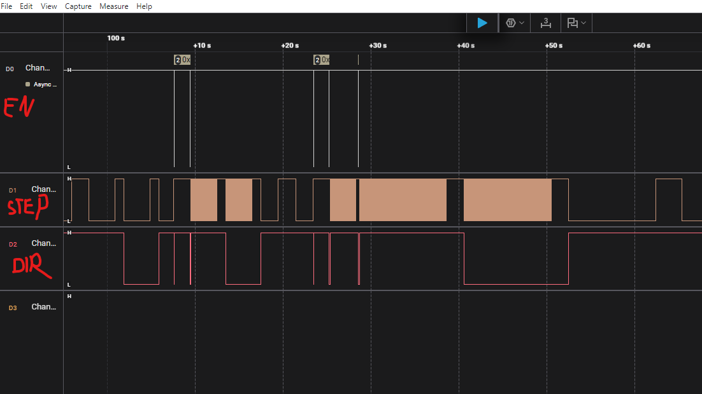
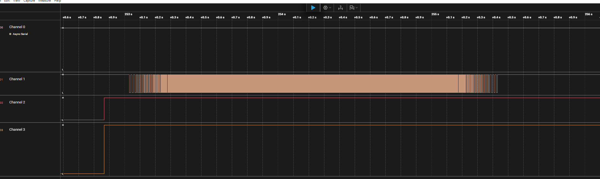

# STM32 Robotics Control System

[](https://github.com/chunsun978/stm32-robotics-control-system/actions)
[](https://github.com/chunsun978/stm32-robotics-control-system/actions)
[](LICENSE)
[](https://en.cppreference.com/w/cpp/17)
[](https://www.st.com/stm32f4)

> **Professional embedded C++ framework for real-time robotics control**
>
> Production-grade motor control system with S-curve motion planning, PID closed-loop control, 
> and automated CI/CD pipeline. Ported from ESP32 with enhanced architecture and portability.

## 🚀 Key Features

- **Modern C++17** - RAII, templates, STL containers on bare metal
- **S-Curve Motion Planning** - Simplified 3-phase profiles for smooth acceleration/deceleration (Hardware Verified ✅)
- **PID Control** - Tunable closed-loop positioning with encoder feedback (In Development)
- **Hardware Abstraction Layer** - Portable across STM32 families and other platforms
- **Real-Time Execution** - Deterministic 1kHz control loop with timer interrupts
- **CI/CD Pipeline** - Automated builds, static analysis, and artifact generation
- **Professional Architecture** - Clean separation of concerns, modular design
- **Comprehensive Documentation** - Detailed guides for setup, porting, and development

## 📊 Hardware Verified - Working Motor Control



**Oscilloscope capture showing successful motor control:**
- **D0 (PA9)**: Enable signal - Active HIGH
- **D1 (PA0)**: STEP pulses - PWM at 100-500 Hz
- **D2 (PA8)**: Direction signal - HIGH=forward, LOW=reverse

✅ **Verified on STM32F411RE Nucleo board**  
✅ **Clean PWM signals with 50% duty cycle**  
✅ **Stable direction and enable control**

### 🎯 S-Curve Motion Control - Advanced Implementation



**Logic analyzer capture showing smooth S-curve motion control:**
- **Channel 1 (STEP)**: Variable frequency PWM - Smooth acceleration/deceleration
- **Channel 2 (DIR)**: Direction changes between forward/reverse moves
- **Channel 3 (ENABLE)**: Controlled enable/disable during motion sequences

**S-Curve Profile Characteristics:**
- 📈 **Smooth Acceleration**: 0 → 500 steps/sec (1000 steps)
- 🚀 **Fast Profile**: 0 → 1000 steps/sec (2000 steps)
- 📉 **Controlled Deceleration**: Jerk-limited smooth stops
- 🔄 **Continuous Operation**: Repeating motion cycles
- 🎵 **Silent Operation**: 50 Hz minimum velocity threshold eliminates audible noise

✅ **Simplified 3-Phase Algorithm** - Robust and reliable  
✅ **Hardware-Verified Timing** - 10ms PWM stabilization delays  
✅ **Production Ready** - Tested with TB6600 stepper driver  

> See [S-Curve Troubleshooting Guide](docs/S-CURVE_TROUBLESHOOTING.md) for implementation details and debugging insights.

---

## 📋 Project Overview

A comprehensive learning platform and production-ready framework for embedded C++ development on STM32F411, featuring motor control, robotics algorithms, and modern C++ practices.

## Features

- ✅ **C++17 Support** - Modern C++ on bare metal
- ✅ **UART Debugging** - `printf` over UART2 (115200 baud)
- ✅ **Motor Control** - Stepper motor control with S-curve motion planning
- ✅ **PID Control** - Closed-loop control algorithms
- ✅ **CI/CD Pipeline** - Automated builds and testing
- ✅ **Portable Design** - Easy to port to other STM32 projects

## 🔧 Hardware Platform

- **MCU**: STM32F411RET6 (ARM Cortex-M4F @ 100 MHz)
- **Board**: STM32F411 Nucleo
- **Flash/RAM**: 512KB / 128KB
- **FPU**: Hardware floating-point unit
- **Debug**: ST-Link v2.1 (integrated)
- **UART**: UART2 on PA2/PA3 (via ST-Link VCP)
- **Timers**: TIM2 (step PWM), TIM3 (encoder), TIM4 (control loop)

### Motor Control Hardware
- **Stepper Driver**: A4988, DRV8825, TB6600 (or similar)
- **Motor**: NEMA 17 bipolar stepper
- **Power**: 12V external supply
- **Encoder**: Optional quadrature encoder for closed-loop control

## Quick Start

### Prerequisites

- [STM32CubeIDE](https://www.st.com/en/development-tools/stm32cubeide.html) (for ARM GCC toolchain)
- [CMake](https://cmake.org/) 3.20+
- [Ninja Build](https://ninja-build.org/)
- [OpenOCD](https://openocd.org/) (for flashing/debugging)

### Build

```powershell
# Quick build (uses Ninja)
.\b

# Or using build script
.\build.ps1

# Clean build
.\build.ps1 -Clean

# Flash to board
.\build.ps1 -Flash
```

### Monitor Serial Output

```powershell
.\serial-monitor.ps1 COM5
```

## Project Structure

```
Core/
├── Inc/
│   ├── Motor/              # Motor control module (portable)
│   │   ├── MotorConfig.hpp    # Hardware abstraction layer
│   │   ├── StepperMotor.hpp
│   │   ├── SCurveProfile.hpp
│   │   ├── MotionPlanner.hpp
│   │   └── PIDController.hpp
│   ├── Led.hpp
│   └── cpp_main.h
├── Src/
│   ├── Motor/              # Motor implementations
│   ├── Led.cpp
│   ├── cpp_main.cpp        # C++ application entry
│   └── main.c              # HAL initialization
docs/
├── COMPILATION.md          # Build system documentation
├── DEBUGGING.md            # Debugging guide
├── CPP_GUIDE.md            # C++ on STM32 guide
├── MOTOR_CONTROL_PORT.md   # Motor porting guide
├── MOTOR_QUICK_START.md    # Quick motor test
└── CI_CD_SETUP.md          # CI/CD documentation
```

## Documentation

- **[Compilation Guide](docs/COMPILATION.md)** - CMake, presets, build options
- **[Debugging Guide](docs/DEBUGGING.md)** - VS Code/Cursor debugging setup
- **[C++ Guide](docs/CPP_GUIDE.md)** - C++ features and patterns
- **[Motor Control Port](docs/MOTOR_CONTROL_PORT.md)** - Porting ESP32 motor control
- **[Motor Quick Start](docs/MOTOR_QUICK_START.md)** - Get motor running in 30 minutes
- **[S-Curve Troubleshooting](docs/S-CURVE_TROUBLESHOOTING.md)** - Complete debugging guide with root cause analysis
- **[CI/CD Setup](docs/CI_CD_SETUP.md)** - Continuous integration guide

## Learning Path

### Phase 1: Basic C++ (✅ Complete)
- [x] LED control with C++ class
- [x] `printf` debugging over UART
- [x] Build automation scripts

### Phase 2: Motor Control (✅ Complete)
- [x] Timer-based PWM for step pulses
- [x] Basic stepper motor control
- [x] S-curve motion planning
- [x] Hardware-verified smooth motion

### Phase 3: Advanced Control
- [ ] PID controller implementation
- [ ] Encoder feedback
- [ ] Closed-loop position control

### Phase 4: System Integration
- [ ] Command parser (UART interface)
- [ ] Multi-axis coordination
- [ ] Trajectory planning

## CI/CD Pipeline

**Fully automated build and testing system:**

### Continuous Integration
Every push to `main` or `dev` triggers:
- ✅ **Multi-config builds** - Debug and Release
- ✅ **Static analysis** - cppcheck for code quality
- ✅ **Complexity analysis** - lizard metrics
- ✅ **Memory reports** - Flash and RAM usage tracking
- ✅ **Artifacts** - Downloadable firmware files

### Continuous Deployment
Tagged releases (`v*.*.*`) automatically:
- ✅ **Build optimized firmware** - Release configuration
- ✅ **Generate release notes** - Memory usage, checksums
- ✅ **Publish to GitHub** - Ready-to-flash binaries
- ✅ **Include documentation** - Flashing instructions

See [CI/CD Documentation](.github/README.md) for complete details.

## Commands

### Build Commands
```powershell
.\b              # Quick build with Ninja
.\build.ps1      # Full build with options
.\build.ps1 -Clean -Ninja -VerboseOutput
.\build.ps1 -Flash  # Build and flash
```

### Debug Commands
```powershell
.\reset-board.ps1      # Reset STM32 via OpenOCD
.\serial-monitor.ps1 COM5  # UART monitor
```

## Contributing

1. Fork the repository
2. Create feature branch (`git checkout -b feature/amazing-feature`)
3. Commit changes (`git commit -m 'Add amazing feature'`)
4. Push to branch (`git push origin feature/amazing-feature`)
5. Open Pull Request

CI/CD will automatically:
- Build your code
- Run static analysis
- Check code quality
- Generate artifacts

## License

This project is for educational purposes.

## Resources

- [STM32F411 Datasheet](https://www.st.com/resource/en/datasheet/stm32f411re.pdf)
- [STM32F4 Reference Manual](https://www.st.com/resource/en/reference_manual/dm00031020.pdf)
- [STM32 HAL Documentation](https://www.st.com/resource/en/user_manual/dm00105879.pdf)
- [C++17 Features](https://en.cppreference.com/w/cpp/17)

## 📈 Project Evolution

This project demonstrates platform migration and architecture improvement:

**Original**: `esp32s3_stepper_scurve_pid` (C, FreeRTOS, ESP-IDF)  
**Enhanced**: `stm32-robotics-control-system` (C++17, bare-metal, portable HAL)

**Key Improvements**:
- Migrated from C to modern C++17
- Designed hardware abstraction layer for portability
- Implemented modular architecture for reusability
- Added comprehensive CI/CD pipeline
- Enhanced documentation and testing

## 🤝 Contributing

Contributions are welcome! Please:
1. Fork the repository
2. Create a feature branch (`git checkout -b feature/amazing-feature`)
3. Commit your changes (`git commit -m 'Add amazing feature'`)
4. Push to the branch (`git push origin feature/amazing-feature`)
5. Open a Pull Request

CI/CD will automatically build and test your changes.

## 📄 License

This project is licensed under the MIT License - see the [LICENSE](LICENSE) file for details.

## 🙏 Acknowledgments

- Motor control algorithms based on `esp32s3_stepper_scurve_pid` project
- STM32 HAL by STMicroelectronics
- Inspired by professional CNC and robotics control systems

## 📞 Contact

- GitHub: [@yourusername](https://github.com/yourusername)
- Project Link: [stm32-robotics-control-system](https://github.com/yourusername/stm32-robotics-control-system)

---

**⭐ If you find this project useful, please consider giving it a star!**

Replace `yourusername` with your actual GitHub username for working badges and links.

